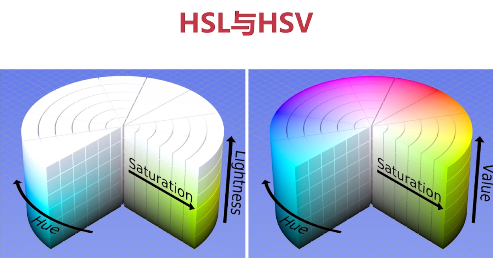

# OpenCV


## 1. OpenCV 介绍

- Gray Bradsky于1999年开发，2000年发布
- C++，Python，Java，JS
- 跨平台（Windows，Linux，Mac...）


为什么选择python？

- python语言简单，开发速度快
- 底层使用c/c++，速度有保障
- 有完整的生态链


## 2. 安装OpenCV

1. 安装虚拟环境

- pip install virtualenv
- virtualenv name (i.e. virtualenv venv) 

2. 安装OpenCV库

- 进入Scripts，cmd
- 激活，activate
- 进入虚拟环境，安装 pip install opencv-python==3.4.1.15，3.4.2之后有些算法申请了专利，用不了了
- 安装opencv扩展包（选装）：pip install opencv-contrib-python==3.4.1.15

*不推荐这种安装方式*


## 3. 图像视频的加载和显示

### 3.1 创建和显示窗口

- namedWindow() - 创建命名窗口
- imshow() - 显示窗口
- destoryAllwindows() - 删除窗口
- resizeWindow() - 改变窗口大小
- waitKey() - 等待用户输入  


```python
# OpenCV API
import cv2

# 创建窗口
# cv2.namedWindow('window', cv2.WINDOW_AUTOSIZE)
cv2.namedWindow('window', cv2.WINDOW_NORMAL)

# 更改窗口大小
cv2.resizeWindow('window', 800, 600)

# 显示窗口
cv2.imshow('window', 0)

# 等待
# waitKey会返回键盘输入的ascii的值，ord()计算ascii值
# 0 表示等待的时间 ms
# cv2.waitKey(0)
key = cv2.waitKey(0)
if key & 0xFF == ord('q'):
    print('destory all of the window')
    cv2.destroyAllWindows()
```


### 3.2 加载显示图片

- imread(path, flag)：使用imread可以读取图片，注意默认读取的不是RGB通道的图片，是BGR图片。比如：


```python
import cv2
import matplotlib.pyplot as plt
import numpy as np

# 读取图片
jennie = cv2.imread('./fig/Jennie.JPG')
# 如果用matplotlib读取图片，则是BGR通道
plt.imshow(jennie)
```


- 原图：


- matplotlib 显示的图片：


```python
# 关闭窗口
def destroy_all_windows():
    key = cv2.waitKey(0)
    if key & 0xFF == ord('q'):
        print('destory all of the window')
        cv2.destroyAllWindows()
```


```python
# 使用opencv读取图片
cv2.imshow('jennie', jennie)
destroy_all_windows()
```


**或者一起封装成函数：**

```python
def cv_show(name, img):
    cv2.imshow(name, img)
    destroy_all_windows()

cv_show('jennie', jennie)
```


**或者封装成外部文件：**

```python
% run cvUtils.py
cv_show('jennie', jennie)
```


### 3.3 保存图片

- imwrite(path, img)：使用imwrite保存图片。


```python
# 创建窗口
cv2.namedWindow('img', cv2.WINDOW_NORMAL)
cv2.resizeWindow('img', 640, 640)

# 读取图片
img = cv2.imread('./fig/Jennie.JPG')

while True:
    cv2.imshow('img', img)
    key = cv2.waitKey(0)
    
    if key == ord('q'):
        break
        
    elif key == ord('s'):
        cv2.imwrite('./fig/testJennie.png', img)
        
    else:
        print(key)
        
cv2.destroyAllWindows()
```


### 3.4 视频采集

- 视频是由图片组成的，视频的每一帧就是一幅图片，一般是30帧，表示一秒显示30张图片。
- cv2.VideoCapture可以捕获摄像头，用数字来表示不同的设备，比如0，1
- 如果是视频文件，可以直接指定路径即可。


```python
cv2.namedWindow('video', cv2.WINDOW_NORMAL)
cv2.resizeWindow('video', 640, 640)

# cap = cv2.VideoCapture(0)

# 打开视频
cap = cv2.VideoCapture('./video/captureCat.mp4')

# 循环读取摄像头的每一帧
while True:     # while cap.isOpened():
    # 读一帧数据，返回标记和这一帧数据。True表示读到数据，False表示未读取到数据
    ret, frame = cap.read()
    
    if not ret:
        break
    
    # 显示数据
    cv2.imshow('video', frame)
    
    # key = cv2.waitKey(10)
    key = cv2.waitKey(1000 // 30)
    
    if key & 0xFF == ord('q'):
        break
        
        
# 释放资源        
cap.release()
cv2.destroyAllWindows()
```


### 3.5 视频录制

- VideoWriter：参数一为输出文件，参数二为多媒体文件格式（VideoWriter_fourcc），参数三为帧率，参数四为分辨率。
- write编码并写入缓存
- release缓存内容写入磁盘，并释放资源


```python
# 录制摄像头拍摄的视频
cap = cv2.VideoCapture(0)
fourcc = cv2.VideoWriter_fourcc(*'mp4v')

# 创建VideoWriter
vw = cv2.VideoWriter('./video/output.mp4', fourcc, 30, (640, 480))

while cap.isOpened():
    ret, frame = cap.read()
    if not ret:
        break
        
    # 写每一帧数据
    vw.write(frame)
    cv2.imshow('frame', frame)
    
    if cv2.waitKey(1) == ord('q'):
        break
                
# 释放资源
cap.release()
vw.release()

cv2.destroyAllWindows()
```


### 3.6 控制鼠标

OpenCV允许我们对窗口上的鼠标动作做出响应。

- setMouseCallback(winname, callback, userdata)，winname是窗口名称，callback是回调函数，userdata是传递给回调函数的参数。
- callback(event, x, y, flags, userdata)回调函数必须包含这五个参数。event是事件（鼠标移动，左键，右键等），x、y是点击鼠标的坐标，flags主要用于组合键，userdata就是上面的setMouseCallback的userdata 。
- 鼠标事件：
  - EVENT_MOUSEMOVE 0 鼠标移动
  - EVENT_LBUTTONDOWN 1 鼠标左击
  - 。。。。。。


```python
# flags组合键
def mouse_callback(event, x, y, flags, userdata):
    print(event, x, y, flags, userdata)
    if event == 2:
        # 点击鼠标右键退出
        cv2.destroyAllWindows()
    
# 创建窗口
cv2.namedWindow('mouse', cv2.WINDOW_NORMAL)
cv2.resizeWindow('mouse', 640, 640)

# 设置鼠标回调函数
cv2.setMouseCallback('mouse', mouse_callback, 'jennie')

# 生成全黑的图片
img = np.zeros((640, 640, 3), np.uint8)

while True:
    cv2.imshow('mouse', img)
    key = cv2.waitKey(1)
    if key == ord('q'):
        break
        
cv2.destroyAllWindows()
```


### 3.7 TrackBar控件


- createTrackbar(trackbarname, winname, value, count, onChange) 创建TrackBar控件，value为trackbar的默认值，count为bar的最大值，最小为0。
- getTrackPos(Trackbarname, winname) 获取TrackBar当前值


```python
# 创建窗口
cv2.namedWindow('trackbar', cv2.WINDOW_NORMAL)
cv2.resizeWindow('trackbar', 640, 480)


# 定义回调函数
def callback(value):
    # print(value)
    pass
    
# 创建TrackBar
cv2.createTrackbar('R', 'trackbar', 0, 255, callback)
cv2.createTrackbar('G', 'trackbar', 0, 255, callback)
cv2.createTrackbar('B', 'trackbar', 0, 255, callback)

# 全黑背景
img = np.zeros((480, 640, 3), np.uint8)

while True:
    # get value
    r = cv2.getTrackbarPos('R', 'trackbar')
    g = cv2.getTrackbarPos('G', 'trackbar')
    b = cv2.getTrackbarPos('B', 'trackbar')
    
    # update
    img[:] = [b, g, r]
    cv2.imshow('trackbar', img)
    key = cv2.waitKey(1)
    if key == ord('q'):
        break        
        
cv2.destroyAllWindows()
```


## 4. OpenCV基础知识和绘制图形


### 4.1 OpenCV的色彩空间

#### 4.1.1 RGB和BGR

最常见的色彩空间就是RGB，而OpenCV默认使用的是BGR。

#### 4.1.2 HSV、HSL和YUV

##### 4.1.2.1 HSV（HSB）

- OpenCV使用最多的色彩空间是HSV。
- Hue：色相，即色彩，如红色、蓝色。用角度度量，取值范围为0~360度，从红色开始按逆时针方向计算，红色为0，绿色为120，蓝色为240。
- Saturation：饱和度，表示颜色接近光谱色的程度，指色彩的纯度，越高色彩越纯，低则逐渐变灰，取0-100%的数值。
- Value：明度，表示颜色的明亮程度。


##### 为什么要使用HSV？

方便OpenCV做图像处理。比如根据Hue的值就可以判断背景颜色。


##### 4.1.2.2 HSL

HSV和HSL差不多。

- Hue：色相
- Saturation：饱和度
- Lightness：亮度





HSL在顶部是纯白色的，不管是什么颜色。


HSV和HSL的区别：（字面上意思是一样的）

- H指的是**色相**(Hue)，就是颜色名称。
- S指的是**饱和度**(Saturation)，即颜色的纯度。
- L（Lightness）和B（Brightness）是**明度**，颜色的明亮程度。


在原理和表现上，HSL和HSB中的H（色相）完全一致，但二者的S（饱和度）不一样，L和B（明度）也不一样：

- HSB 中的 S 控制纯色中混入**白色**的量，值越大，白色越少，颜色**越纯**；
- HSB 中的 B 控制纯色中混入**黑色**的量，值越大，黑色越少，明度**越高**；
- HSL 中的 S 和黑白没有关系，饱和度不控制颜色中混入黑白的多寡；
- HSL 中的L 控制纯色中的混入的**黑白两种颜色**。


##### 4.1.2.3 YUV

**YUV**，是一种颜色编码方法。常使用在各个视频处理组件中。 YUV在对照片或视频编码时，考虑到人类的感知能力，允许降低色度的带宽。

“Y”表示明亮度（Luminance或Luma），也就是灰阶值，“U”和“V”表示的则是色度（Chrominance或Chroma），作用是描述影像色彩及饱和度，用于指定像素的颜色。

YUV的发明是由于彩色电视与黑白电视的过渡时期。

YUV最大的优点在于只需占用极少的带宽。

- 4:4:4表示完全取样。

- 4:2:2表示2:1的水平取样，垂直完全采样。

- 4:2:0表示2:1的水平取样，垂直2：1采样。

- 4:1:1表示4:1的水平取样，垂直完全采样。


#### 4.1.3 色彩空间的转换

- cvtColor(img, colorspace): 颜色转换的关键API。

```python
# 关键API cv2.cvtColor
import cv2

def callback(value):
    pass


cv2.namedWindow('color', cv2.WINDOW_NORMAL)
cv2.resizeWindow('color', 640, 480)

# 读取照片，OpenCV默认读进来的照片是BGR
img = cv2.imread(".\\fig\\Jennie.png")

# 定义颜色空间转化列表
color_spaces = [
    cv2.COLOR_BGR2RGBA, cv2.COLOR_BGR2RGBA,
    cv2.COLOR_BGR2GRAY, cv2.COLOR_BGRA2BGR,
    cv2.COLOR_BGR2YUV
]

# 设置trackbar
cv2.createTrackbar('trackbar', 'color', 0, 4, callback)

while True:
    # 获取trackbar的值
    index = cv2.getTrackbarPos('trackbar', 'color')
    
    # 进行颜色空间转换
    cvt_img = cv2.cvtColor(img, color_spaces[index])
    
    cv2.imshow('color', cvt_img)
    
    key = cv2.waitKey(10)
    if key == ord('q'):
        break
    
cv2.destroyAllWindows()
```


### 4.2 OpenCV的重要数据结构--Mat

#### 4.2.1 Mat简介

Mat是OpenCV在C++语言中用来表示图像数据的一种数据结构.在python中转化为numpy的ndarray.

- Mat由header和data组成, header中记录了图片的维数, 大小, 数据类型等数据.


#### 4.2.2 Mat拷贝

- Mat共享数据


在python中Mat数据对应numpy的ndarray, 使用numpy提供的深浅拷贝方法即可实现Mat的拷贝.


```python
import cv2
import numpy as np

img = cv2.imread('./cat.jpeg')

#浅拷贝
img2 = img.view()

#深拷贝
img3 = img.copy()

img[10:100, 10:100] = [0, 0, 255]

cv2.imshow('img', img)
cv2.imshow('img2', img2)
cv2.imshow('img3', img3)

cv2.waitKey(0)
cv2.destroyAllWindows()

```


#### 4.2.3 访问图像（Mat）的属性

OpenCV中的Mat在python中已经转化为ndarray, 通过ndarray的属性即可访问Mat图像的属性

```python
import cv2
import numpy as np

img = cv2.imread('cat.jpeg')

#shape属性中包括了三个信息
#高度，长度 和 通道数
print(img.shape)

#图像占用多大空间
#高度 * 长度 * 通道数
print(img.size)

#图像中每个元素的位深
print(img.dtype)

```


#### 4.2.4 通道的分离与合并

- split(mat)分割图像的通道

- merge((ch1,ch2, ch3)) 融合多个通道


```python
import cv2
import numpy as np

img = np.zeros((480, 640, 3), np.uint8)

b,g,r = cv2.split(img)

b[10:100, 10:100] = 255
g[10:100, 10:100] = 255

img2 = cv2.merge((b, g, r))

cv2.imshow('img', img)
cv2.imshow('b', b)
cv2.imshow('g', g)
cv2.imshow('img2', img2)

cv2.waitKey(0)
cv2.destroyAllWindows()

```


### 4.3 绘制图形

利用OpenCV提供的绘制图形API可以轻松在图像上绘制各种图形, 比如直线, 矩形, 圆, 椭圆等图形.

- line(img, pt1, pt2, color, thickness, lineType, shift) 画直线

  - img: 在哪个图像上画线

  - pt1, pt2: 开始点, 结束点. 指定线的开始与结束位置

  - color: 颜色

  - thickness: 线宽

  - lineType: 线型.线型为-1, 4, 8, 16, 默认为8

  - shift: 坐标缩放比例.

- rectangle() 参数同上 画矩形

- circle(img, center, radius, color[, thickness[, lineType[, shift]]]) 中括号内参数表示可选参数. 画圆

- ellipse(img, 中心点, 长宽的一半, 角度, 从哪个角度开始, 从哪个角度结束,...)


- polylines(img, pts, isClosed, color[, thickness[, lineType[, shift]]]) 画多边形

- fillPoly 填充多边形

- putText(img, text, org, fontFace, fontScale, color[, thickness[, lineType[, bottomLeftOrigin]]]) 绘制文本

  - text 要绘制的文本

  - org 文本在图片中的左下角坐标

  - fontFace 字体类型即字体

  - fontScale 字体大小


```python
import cv2
import numpy as np

img = np.zeros((480, 640, 3), np.uint8)
# cv2.line(img, (10, 20), (300, 400), (0, 0, 255), 5, 4)
# cv2.line(img, (80, 100), (380, 480), (0, 0, 255), 5, 16)

# 画矩形
# cv2.rectangle(img, (10,10), (100, 100), (0, 0, 255), -1)

# 画圆
# cv2.circle(img, (320, 240), 100, (0, 0, 255))
# cv2.circle(img, (320, 240), 5, (0, 0, 255), -1)
# 画椭圆
# cv2.ellipse(img, (320, 240), (100, 50), 15, 0, 360, (0, 0, 255), -1)

#画多边形
# pts = np.array([(300, 10), (150, 100), (450, 100)], np.int32)
# cv2.polylines(img, [pts], True, (0, 0, 255))

#填充多边形
# cv2.fillPoly(img, [pts], (255, 255, 0))
cv2.putText(img, "Hello OpenCV!", (10, 400), cv2.FONT_HERSHEY_TRIPLEX, 3, (255,0,0))
cv2.imshow('draw', img)
cv2.waitKey(0)
cv2.destroyAllWindows()

```


- 绘制中文 opencv本身不支持, 因为没有中文字体.我们可以借助pillow来实现绘制中文

```python
# 安装pillow
import cv2
import numpy as np
from PIL import ImageFont, ImageDraw, Image

img = np.full((200, 200, 3), fill_value=255, dtype=np.uint8)
# 导入字体文件. 
font_path = 'msyhbd.ttc'
font = ImageFont.truetype(font_path, 15)
img_pil = Image.fromarray(img)
draw = ImageDraw.Draw(img_pil)
draw.text((10, 150), '绘制中文', font=font, fill=(0, 255, 0, 0))
img = np.array(img_pil)

# 中文会显示问号
cv2.putText(img, '中文', (10, 100), cv2.FONT_HERSHEY_SIMPLEX, 1, (255, 0, 0), 1)

cv2.imshow('img', img)
cv2.waitKey(0)
cv2.destroyAllWindows()

```


**作业：**

写一个程序, 实现按l键之后拖动鼠标绘制直线, 按r键之后拖动鼠标绘制矩形, 按r键拖动鼠标绘制圆形

代码：[作业1](./作业1.ipynb)


## 5. 图像的算数与位运算

### 5.1 图像的算数运算

#### 5.1.1 图像的加、减、乘、除运算

- add opencv使用add来执行图像的加法运算

图片就是矩阵，图片的加法运算就是矩阵的加法运算，这就要求加法运算的两张图shape必须是相同的。


```python
import cv2
import numpy as np

# 加法运算

# 读取图片
iu = cv2.imread('./fig/iu.png')

jennie = cv2.imread('./fig/Jennie.png')

print(iu.shape)
print(jennie.shape)

# 加法要求两个图片大小一致
# 使用ndarray的切片，切出大小一样的图片
new_jennie = jennie[0:380, 0:380]
print(new_jennie.shape)

#加法，加法的效果是加起来如果超过255，统一变成255
new_img = cv2.add(iu, new_jennie)

cv2.imshow('new_img', new_img)
cv2.waitKey(0)
cv2.destroyAllWindows()

# 图片还可以和单个数字进行运算
# 超出255的数字，会被截断，相当于 % 255

iu += 100
print(iu[:2, :2])

cv2.imshow('iu', iu)
cv2.waitKey(0)
cv2.destroyAllWindows()

# 减法运算
# 小于0，为0
iu -= 100
new_img1 = cv2.subtract(new_jennie, iu)

cv2.imshow('img1', new_img1)
cv2.waitKey(0)
cv2.destroyAllWindows()

# 乘法运算
iu -= 100
jennie -= 100
new_img2 = cv2.multiply(new_jennie, iu)

cv2.imshow('img2', new_img2)
cv2.waitKey(0)
cv2.destroyAllWindows()

# 除法运算
iu += 100
jennie += 200
new_img3 = cv2.divide(new_jennie, iu)

cv2.imshow('img3', new_img3)
cv2.waitKey(0)
cv2.destroyAllWindows()
```


#### 5.1.2 图像的融合

- cv2.addWeighted(src1, alpha, src2, beta, gamma)
- 图片的融合操作相当于对图片进行线性运算 w1\*x1 +w2*x2 + b，其中alpha是第一个权重参数，beta是第二个权重参数，gamma是偏差。


```python
# 不是简单的加法，相当于对图像做了线性运算。
# new_img = w1 * img1 + w2 * img2 + bias

# 读取图片
iu = cv2.imread('./fig/iu.png')
jennie = cv2.imread('./fig/Jennie.png')

new_jennie = jennie[0:380, 0:380]

new_img4 = cv2.addWeighted(new_jennie, 0.3, iu, 0.7, +50)

cv2.imshow('img4', new_img4)
cv2.waitKey(0)
cv2.destroyAllWindows()
```


### 5.3 OpenCV的位运算

```python
# OpenCV中的逻辑运算就是对应位置元素进行与或非，异或运算

# 读取图片
iu = cv2.imread('./fig/iu.png')
jennie = cv2.imread('./fig/Jennie.png')

# 非
# iu_not = cv2.bitwise_not(iu)

# 与
# iu_and = cv2.bitwise_and(iu, new_jennie)

# 或
# iu_or = cv2.bitwise_or(iu, new_jennie)

# 异或
iu_xor = cv2.bitwise_xor(iu, new_jennie)

print(iu[:2, :2])
# print(iu_not[:2, :2])
# print(iu_and[:2, :2])
# print(iu_or[:2, :2])
# print(iu_xor[:2, :2])

# cv2.imshow('not', np.hstack((iu, iu_not)))
# cv2.imshow('and', np.hstack((iu, iu_and)))
# cv2.imshow('or', np.hstack((iu, new_jennie, iu_or)))
cv2.imshow('xor', np.hstack((iu, new_jennie, iu_xor)))

cv2.waitKey(0)
cv2.destroyAllWindows()
```


## 6. 图像的基本变换


---


**示例代码：**

- ##### [3.图像视频的加载和显示](./图像和视频的加载和显示.ipynb)

- ##### [4.OpenCV基础知识和绘制图形](./OpenCV基础知识和绘制图形.ipynb)