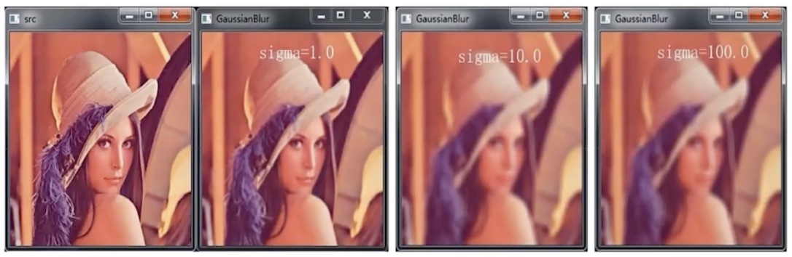
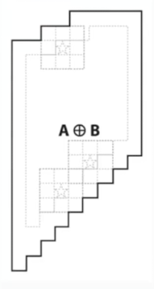
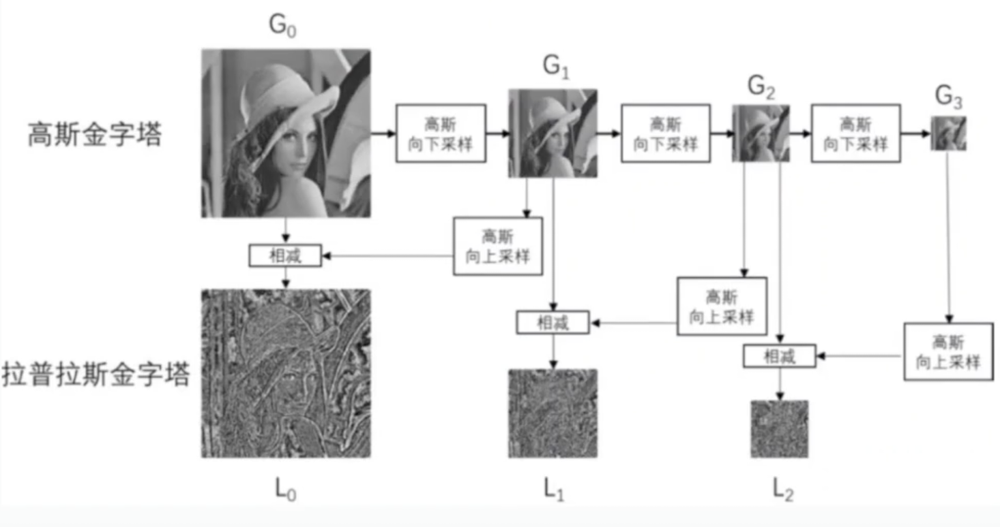

# 目录

----

- **[1.OpenCV 介绍](#1.-opencv-介绍)**
- **[2.安装OpenCV](#2.-安装opencv)**
- **[3. 图像视频的加载和显示](#3.-图像视频的加载和显示)**

-----


## 1. OpenCV 介绍

- Gray Bradsky于1999年开发，2000年发布
- C++，Python，Java，JS
- 跨平台（Windows，Linux，Mac...）


为什么选择python？

- python语言简单，开发速度快
- 底层使用c/c++，速度有保障
- 有完整的生态链


## 2. 安装OpenCV

1. 安装虚拟环境

- pip install virtualenv
- virtualenv name (i.e. virtualenv venv) 

2. 安装OpenCV库

- 进入Scripts，cmd
- 激活，activate
- 进入虚拟环境，安装 pip install opencv-python==3.4.1.15，3.4.2之后有些算法申请了专利，用不了了
- 安装opencv扩展包（选装）：pip install opencv-contrib-python==3.4.1.15

*不推荐这种安装方式*


## 3. 图像视频的加载和显示

### 3.1 创建和显示窗口

- namedWindow() - 创建命名窗口
- imshow() - 显示窗口
- destoryAllwindows() - 删除窗口
- resizeWindow() - 改变窗口大小
- waitKey() - 等待用户输入  


```python
# OpenCV API
import cv2

# 创建窗口
# cv2.namedWindow('window', cv2.WINDOW_AUTOSIZE)
cv2.namedWindow('window', cv2.WINDOW_NORMAL)

# 更改窗口大小
cv2.resizeWindow('window', 800, 600)

# 显示窗口
cv2.imshow('window', 0)

# 等待
# waitKey会返回键盘输入的ascii的值，ord()计算ascii值
# 0 表示等待的时间 ms
# cv2.waitKey(0)
key = cv2.waitKey(0)
if key & 0xFF == ord('q'):
    print('destory all of the window')
    cv2.destroyAllWindows()
```


### 3.2 加载显示图片

- imread(path, flag)：使用imread可以读取图片，注意默认读取的不是RGB通道的图片，是BGR图片。比如：


```python
import cv2
import matplotlib.pyplot as plt
import numpy as np

# 读取图片
jennie = cv2.imread('./fig/Jennie.JPG')
# 如果用matplotlib读取图片，则是BGR通道
plt.imshow(jennie)
```


- 原图：


- matplotlib 显示的图片：


```python
# 关闭窗口
def destroy_all_windows():
    key = cv2.waitKey(0)
    if key & 0xFF == ord('q'):
        print('destory all of the window')
        cv2.destroyAllWindows()
```


```python
# 使用opencv读取图片
cv2.imshow('jennie', jennie)
destroy_all_windows()
```


**或者一起封装成函数：**

```python
def cv_show(name, img):
    cv2.imshow(name, img)
    destroy_all_windows()

cv_show('jennie', jennie)
```


**或者封装成外部文件：**

```python
% run cvUtils.py
cv_show('jennie', jennie)
```


### 3.3 保存图片

- imwrite(path, img)：使用imwrite保存图片。


```python
# 创建窗口
cv2.namedWindow('img', cv2.WINDOW_NORMAL)
cv2.resizeWindow('img', 640, 640)

# 读取图片
img = cv2.imread('./fig/Jennie.JPG')

while True:
    cv2.imshow('img', img)
    key = cv2.waitKey(0)
    
    if key == ord('q'):
        break
        
    elif key == ord('s'):
        cv2.imwrite('./fig/testJennie.png', img)
        
    else:
        print(key)
        
cv2.destroyAllWindows()
```


### 3.4 视频采集

- 视频是由图片组成的，视频的每一帧就是一幅图片，一般是30帧，表示一秒显示30张图片。
- cv2.VideoCapture可以捕获摄像头，用数字来表示不同的设备，比如0，1
- 如果是视频文件，可以直接指定路径即可。


```python
cv2.namedWindow('video', cv2.WINDOW_NORMAL)
cv2.resizeWindow('video', 640, 640)

# cap = cv2.VideoCapture(0)

# 打开视频
cap = cv2.VideoCapture('./video/captureCat.mp4')

# 循环读取摄像头的每一帧
while True:     # while cap.isOpened():
    # 读一帧数据，返回标记和这一帧数据。True表示读到数据，False表示未读取到数据
    ret, frame = cap.read()
    
    if not ret:
        break
    
    # 显示数据
    cv2.imshow('video', frame)
    
    # key = cv2.waitKey(10)
    key = cv2.waitKey(1000 // 30)
    
    if key & 0xFF == ord('q'):
        break
        
        
# 释放资源        
cap.release()
cv2.destroyAllWindows()
```


### 3.5 视频录制

- VideoWriter：参数一为输出文件，参数二为多媒体文件格式（VideoWriter_fourcc），参数三为帧率，参数四为分辨率。
- write编码并写入缓存
- release缓存内容写入磁盘，并释放资源


```python
# 录制摄像头拍摄的视频
cap = cv2.VideoCapture(0)
fourcc = cv2.VideoWriter_fourcc(*'mp4v')

# 创建VideoWriter
vw = cv2.VideoWriter('./video/output.mp4', fourcc, 30, (640, 480))

while cap.isOpened():
    ret, frame = cap.read()
    if not ret:
        break
        
    # 写每一帧数据
    vw.write(frame)
    cv2.imshow('frame', frame)
    
    if cv2.waitKey(1) == ord('q'):
        break
                
# 释放资源
cap.release()
vw.release()

cv2.destroyAllWindows()
```


### 3.6 控制鼠标

OpenCV允许我们对窗口上的鼠标动作做出响应。

- setMouseCallback(winname, callback, userdata)，winname是窗口名称，callback是回调函数，userdata是传递给回调函数的参数。
- callback(event, x, y, flags, userdata)回调函数必须包含这五个参数。event是事件（鼠标移动，左键，右键等），x、y是点击鼠标的坐标，flags主要用于组合键，userdata就是上面的setMouseCallback的userdata 。
- 鼠标事件：
  - EVENT_MOUSEMOVE 0 鼠标移动
  - EVENT_LBUTTONDOWN 1 鼠标左击
  - 。。。。。。


```python
# flags组合键
def mouse_callback(event, x, y, flags, userdata):
    print(event, x, y, flags, userdata)
    if event == 2:
        # 点击鼠标右键退出
        cv2.destroyAllWindows()
    
# 创建窗口
cv2.namedWindow('mouse', cv2.WINDOW_NORMAL)
cv2.resizeWindow('mouse', 640, 640)

# 设置鼠标回调函数
cv2.setMouseCallback('mouse', mouse_callback, 'jennie')

# 生成全黑的图片
img = np.zeros((640, 640, 3), np.uint8)

while True:
    cv2.imshow('mouse', img)
    key = cv2.waitKey(1)
    if key == ord('q'):
        break
        
cv2.destroyAllWindows()
```


### 3.7 TrackBar控件


- createTrackbar(trackbarname, winname, value, count, onChange) 创建TrackBar控件，value为trackbar的默认值，count为bar的最大值，最小为0。
- getTrackPos(Trackbarname, winname) 获取TrackBar当前值


```python
# 创建窗口
cv2.namedWindow('trackbar', cv2.WINDOW_NORMAL)
cv2.resizeWindow('trackbar', 640, 480)


# 定义回调函数
def callback(value):
    # print(value)
    pass
    
# 创建TrackBar
cv2.createTrackbar('R', 'trackbar', 0, 255, callback)
cv2.createTrackbar('G', 'trackbar', 0, 255, callback)
cv2.createTrackbar('B', 'trackbar', 0, 255, callback)

# 全黑背景
img = np.zeros((480, 640, 3), np.uint8)

while True:
    # get value
    r = cv2.getTrackbarPos('R', 'trackbar')
    g = cv2.getTrackbarPos('G', 'trackbar')
    b = cv2.getTrackbarPos('B', 'trackbar')
    
    # update
    img[:] = [b, g, r]
    cv2.imshow('trackbar', img)
    key = cv2.waitKey(1)
    if key == ord('q'):
        break        
        
cv2.destroyAllWindows()
```


## 4. OpenCV基础知识和绘制图形


### 4.1 OpenCV的色彩空间

#### 4.1.1 RGB和BGR

最常见的色彩空间就是RGB，而OpenCV默认使用的是BGR。

#### 4.1.2 HSV、HSL和YUV

##### 4.1.2.1 HSV（HSB）

- OpenCV使用最多的色彩空间是HSV。
- Hue：色相，即色彩，如红色、蓝色。用角度度量，取值范围为0~360度，从红色开始按逆时针方向计算，红色为0，绿色为120，蓝色为240。
- Saturation：饱和度，表示颜色接近光谱色的程度，指色彩的纯度，越高色彩越纯，低则逐渐变灰，取0-100%的数值。
- Value：明度，表示颜色的明亮程度。


##### 为什么要使用HSV？

方便OpenCV做图像处理。比如根据Hue的值就可以判断背景颜色。


##### 4.1.2.2 HSL

HSV和HSL差不多。

- Hue：色相
- Saturation：饱和度
- Lightness：亮度


HSL在顶部是纯白色的，不管是什么颜色。


HSV和HSL的区别：（字面上意思是一样的）

- H指的是**色相**(Hue)，就是颜色名称。
- S指的是**饱和度**(Saturation)，即颜色的纯度。
- L（Lightness）和B（Brightness）是**明度**，颜色的明亮程度。


在原理和表现上，HSL和HSB中的H（色相）完全一致，但二者的S（饱和度）不一样，L和B（明度）也不一样：

- HSB 中的 S 控制纯色中混入**白色**的量，值越大，白色越少，颜色**越纯**；
- HSB 中的 B 控制纯色中混入**黑色**的量，值越大，黑色越少，明度**越高**；
- HSL 中的 S 和黑白没有关系，饱和度不控制颜色中混入黑白的多寡；
- HSL 中的L 控制纯色中的混入的**黑白两种颜色**。


##### 4.1.2.3 YUV

**YUV**，是一种颜色编码方法。常使用在各个视频处理组件中。 YUV在对照片或视频编码时，考虑到人类的感知能力，允许降低色度的带宽。

“Y”表示明亮度（Luminance或Luma），也就是灰阶值，“U”和“V”表示的则是色度（Chrominance或Chroma），作用是描述影像色彩及饱和度，用于指定像素的颜色。

YUV的发明是由于彩色电视与黑白电视的过渡时期。

YUV最大的优点在于只需占用极少的带宽。

- 4:4:4表示完全取样。

- 4:2:2表示2:1的水平取样，垂直完全采样。

- 4:2:0表示2:1的水平取样，垂直2：1采样。

- 4:1:1表示4:1的水平取样，垂直完全采样。


#### 4.1.3 色彩空间的转换

- cvtColor(img, colorspace): 颜色转换的关键API。

```python
# 关键API cv2.cvtColor
import cv2

def callback(value):
    pass


cv2.namedWindow('color', cv2.WINDOW_NORMAL)
cv2.resizeWindow('color', 640, 480)

# 读取照片，OpenCV默认读进来的照片是BGR
img = cv2.imread(".\\fig\\Jennie.png")

# 定义颜色空间转化列表
color_spaces = [
    cv2.COLOR_BGR2RGBA, cv2.COLOR_BGR2RGBA,
    cv2.COLOR_BGR2GRAY, cv2.COLOR_BGRA2BGR,
    cv2.COLOR_BGR2YUV
]

# 设置trackbar
cv2.createTrackbar('trackbar', 'color', 0, 4, callback)

while True:
    # 获取trackbar的值
    index = cv2.getTrackbarPos('trackbar', 'color')
    
    # 进行颜色空间转换
    cvt_img = cv2.cvtColor(img, color_spaces[index])
    
    cv2.imshow('color', cvt_img)
    
    key = cv2.waitKey(10)
    if key == ord('q'):
        break
    
cv2.destroyAllWindows()
```


### 4.2 OpenCV的重要数据结构--Mat

#### 4.2.1 Mat简介

Mat是OpenCV在C++语言中用来表示图像数据的一种数据结构.在python中转化为numpy的ndarray.

- Mat由header和data组成, header中记录了图片的维数, 大小, 数据类型等数据.


#### 4.2.2 Mat拷贝

- Mat共享数据


在python中Mat数据对应numpy的ndarray, 使用numpy提供的深浅拷贝方法即可实现Mat的拷贝.


```python
import cv2
import numpy as np

img = cv2.imread('./cat.jpeg')

#浅拷贝
img2 = img.view()

#深拷贝
img3 = img.copy()

img[10:100, 10:100] = [0, 0, 255]

cv2.imshow('img', img)
cv2.imshow('img2', img2)
cv2.imshow('img3', img3)

cv2.waitKey(0)
cv2.destroyAllWindows()

```


#### 4.2.3 访问图像（Mat）的属性

OpenCV中的Mat在python中已经转化为ndarray, 通过ndarray的属性即可访问Mat图像的属性

```python
import cv2
import numpy as np

img = cv2.imread('cat.jpeg')

#shape属性中包括了三个信息
#高度，长度 和 通道数
print(img.shape)

#图像占用多大空间
#高度 * 长度 * 通道数
print(img.size)

#图像中每个元素的位深
print(img.dtype)

```


#### 4.2.4 通道的分离与合并

- split(mat)分割图像的通道

- merge((ch1,ch2, ch3)) 融合多个通道


```python
import cv2
import numpy as np

img = np.zeros((480, 640, 3), np.uint8)

b,g,r = cv2.split(img)

b[10:100, 10:100] = 255
g[10:100, 10:100] = 255

img2 = cv2.merge((b, g, r))

cv2.imshow('img', img)
cv2.imshow('b', b)
cv2.imshow('g', g)
cv2.imshow('img2', img2)

cv2.waitKey(0)
cv2.destroyAllWindows()

```


### 4.3 绘制图形

利用OpenCV提供的绘制图形API可以轻松在图像上绘制各种图形, 比如直线, 矩形, 圆, 椭圆等图形.

- line(img, pt1, pt2, color, thickness, lineType, shift) 画直线

  - img: 在哪个图像上画线

  - pt1, pt2: 开始点, 结束点. 指定线的开始与结束位置

  - color: 颜色

  - thickness: 线宽

  - lineType: 线型.线型为-1, 4, 8, 16, 默认为8

  - shift: 坐标缩放比例.

- rectangle() 参数同上 画矩形

- circle(img, center, radius, color[, thickness[, lineType[, shift]]]) 中括号内参数表示可选参数. 画圆

- ellipse(img, 中心点, 长宽的一半, 角度, 从哪个角度开始, 从哪个角度结束,...)


- polylines(img, pts, isClosed, color[, thickness[, lineType[, shift]]]) 画多边形

- fillPoly 填充多边形

- putText(img, text, org, fontFace, fontScale, color[, thickness[, lineType[, bottomLeftOrigin]]]) 绘制文本

  - text 要绘制的文本

  - org 文本在图片中的左下角坐标

  - fontFace 字体类型即字体

  - fontScale 字体大小


```python
import cv2
import numpy as np

img = np.zeros((480, 640, 3), np.uint8)
# cv2.line(img, (10, 20), (300, 400), (0, 0, 255), 5, 4)
# cv2.line(img, (80, 100), (380, 480), (0, 0, 255), 5, 16)

# 画矩形
# cv2.rectangle(img, (10,10), (100, 100), (0, 0, 255), -1)

# 画圆
# cv2.circle(img, (320, 240), 100, (0, 0, 255))
# cv2.circle(img, (320, 240), 5, (0, 0, 255), -1)
# 画椭圆
# cv2.ellipse(img, (320, 240), (100, 50), 15, 0, 360, (0, 0, 255), -1)

#画多边形
# pts = np.array([(300, 10), (150, 100), (450, 100)], np.int32)
# cv2.polylines(img, [pts], True, (0, 0, 255))

#填充多边形
# cv2.fillPoly(img, [pts], (255, 255, 0))
cv2.putText(img, "Hello OpenCV!", (10, 400), cv2.FONT_HERSHEY_TRIPLEX, 3, (255,0,0))
cv2.imshow('draw', img)
cv2.waitKey(0)
cv2.destroyAllWindows()

```


- 绘制中文 opencv本身不支持, 因为没有中文字体.我们可以借助pillow来实现绘制中文

```python
# 安装pillow
import cv2
import numpy as np
from PIL import ImageFont, ImageDraw, Image

img = np.full((200, 200, 3), fill_value=255, dtype=np.uint8)
# 导入字体文件. 
font_path = 'msyhbd.ttc'
font = ImageFont.truetype(font_path, 15)
img_pil = Image.fromarray(img)
draw = ImageDraw.Draw(img_pil)
draw.text((10, 150), '绘制中文', font=font, fill=(0, 255, 0, 0))
img = np.array(img_pil)

# 中文会显示问号
cv2.putText(img, '中文', (10, 100), cv2.FONT_HERSHEY_SIMPLEX, 1, (255, 0, 0), 1)

cv2.imshow('img', img)
cv2.waitKey(0)
cv2.destroyAllWindows()

```


**作业：**

写一个程序, 实现按l键之后拖动鼠标绘制直线, 按r键之后拖动鼠标绘制矩形, 按r键拖动鼠标绘制圆形

代码：[作业1](./作业1.ipynb)


## 5. 图像的算数与位运算

### 5.1 图像的算数运算

#### 5.1.1 图像的加、减、乘、除运算

- add opencv使用add来执行图像的加法运算

图片就是矩阵，图片的加法运算就是矩阵的加法运算，这就要求加法运算的两张图shape必须是相同的。


```python
import cv2
import numpy as np

# 加法运算

# 读取图片
iu = cv2.imread('./fig/iu.png')

jennie = cv2.imread('./fig/Jennie.png')

print(iu.shape)
print(jennie.shape)

# 加法要求两个图片大小一致
# 使用ndarray的切片，切出大小一样的图片
new_jennie = jennie[0:380, 0:380]
print(new_jennie.shape)

#加法，加法的效果是加起来如果超过255，统一变成255
new_img = cv2.add(iu, new_jennie)

cv2.imshow('new_img', new_img)
cv2.waitKey(0)
cv2.destroyAllWindows()

# 图片还可以和单个数字进行运算
# 超出255的数字，会被截断，相当于 % 255

iu += 100
print(iu[:2, :2])

cv2.imshow('iu', iu)
cv2.waitKey(0)
cv2.destroyAllWindows()

# 减法运算
# 小于0，为0
iu -= 100
new_img1 = cv2.subtract(new_jennie, iu)

cv2.imshow('img1', new_img1)
cv2.waitKey(0)
cv2.destroyAllWindows()

# 乘法运算
iu -= 100
jennie -= 100
new_img2 = cv2.multiply(new_jennie, iu)

cv2.imshow('img2', new_img2)
cv2.waitKey(0)
cv2.destroyAllWindows()

# 除法运算
iu += 100
jennie += 200
new_img3 = cv2.divide(new_jennie, iu)

cv2.imshow('img3', new_img3)
cv2.waitKey(0)
cv2.destroyAllWindows()
```


#### 5.1.2 图像的融合

- cv2.addWeighted(src1, alpha, src2, beta, gamma)
- 图片的融合操作相当于对图片进行线性运算 w1\*x1 +w2*x2 + b，其中alpha是第一个权重参数，beta是第二个权重参数，gamma是偏差。


```python
# 不是简单的加法，相当于对图像做了线性运算。
# new_img = w1 * img1 + w2 * img2 + bias

# 读取图片
iu = cv2.imread('./fig/iu.png')
jennie = cv2.imread('./fig/Jennie.png')

new_jennie = jennie[0:380, 0:380]

new_img4 = cv2.addWeighted(new_jennie, 0.3, iu, 0.7, +50)

cv2.imshow('img4', new_img4)
cv2.waitKey(0)
cv2.destroyAllWindows()
```


### 5.3 OpenCV的位运算

```python
# OpenCV中的逻辑运算就是对应位置元素进行与或非，异或运算

# 读取图片
iu = cv2.imread('./fig/iu.png')
jennie = cv2.imread('./fig/Jennie.png')

# 非
# iu_not = cv2.bitwise_not(iu)

# 与
# iu_and = cv2.bitwise_and(iu, new_jennie)

# 或
# iu_or = cv2.bitwise_or(iu, new_jennie)

# 异或
iu_xor = cv2.bitwise_xor(iu, new_jennie)

print(iu[:2, :2])
# print(iu_not[:2, :2])
# print(iu_and[:2, :2])
# print(iu_or[:2, :2])
# print(iu_xor[:2, :2])

# cv2.imshow('not', np.hstack((iu, iu_not)))
# cv2.imshow('and', np.hstack((iu, iu_and)))
# cv2.imshow('or', np.hstack((iu, new_jennie, iu_or)))
cv2.imshow('xor', np.hstack((iu, new_jennie, iu_xor)))

cv2.waitKey(0)
cv2.destroyAllWindows()
```


## 6. 图像的基本变换

### 6.1 图像的放大和缩小

- resize(src, dsize[, dst[, fx[, fy[, interpolation]]]])
  - src:要缩放的图片
  - dsize:缩放之后的图片大小，元组和列表表示均可
  - dst:可选参数，缩放之后的输出图片
  - fx, fy:x轴和y轴的缩放比，即宽度和高度的缩放比
  - interpolation:插值算法，主要有以下几种：
    - INTER_NEAREST,临近插值，速度快，效果差
    - INTER_LINEAR,双线性插值，使用原图中的四个点进行插值，默认
    - INTER_CUBIC,三次插值，原图中的16个点
    - INTER_AREA,区域插值，效果最好，计算时间最长


```python
import cv2
import numpy as np

jennie = cv2.imread('./fig/Jennie.png')
iu = cv2.imread('./fig/iu.png')

print(jennie.shape)
print(iu.shape)

# resize
new_jennie = cv2.resize(jennie, (380, 380))
# new_jennie = cv2.resize(jennie, dsize=None, fx=0.5, fy=0.5)
print(new_jennie.shape)

cv2.imshow('new_jennie', np.hstack((iu, new_jennie)))

cv2.waitKey(0)
cv2.destroyAllWindows()
```


**作业：**

在图片上加上自己设计的logo，建议logo简单一点

代码：[作业2](./作业2.ipynb)


### 6.2 图像的翻转

- flip(src, flipCode)
  - flipCode = 0 表示上下翻转
  - flipCode > 0 表示左右反转
  - flipCode < 0 上下 + 左右


```python
import cv2
import numpy as np

jennie = cv2.imread('./fig/Jennie.png')

new_jennie = cv2.flip(jennie, 0)

cv2.imshow('new_jennie', np.hstack((jennie, new_jennie)))

cv2.waitKey(0)
cv2.destroyAllWindows()
```


### 6.3 图像的旋转

- rotate(img, rotateCode)
  - ROTATE_90_CLOCKWISE 90度顺时针
  - ROTATE_180 180度
  - ROTATE_90_COUNTERCLOCKWISE 90度逆时针


```python
import cv2
import numpy as np


# rotate
jennie = cv2.imread('./fig/Jennie.png')

new_jennie = cv2.rotate(jennie, rotateCode=cv2.ROTATE_90_COUNTERCLOCKWISE)

cv2.imshow('new_jennie', new_jennie)
cv2.waitKey(0)
cv2.destroyAllWindows()
```


### 6.4 仿射变换之图像平移

- 仿射变换是图像旋转,缩放,平移的总称,具体的做法是通过一个矩阵和和原图片坐标进行计算,得到新的坐标,完成变换.所以关键就是这个矩阵.

- warpAffine(src, M, dsize, flags, mode, value)

- M:变换矩阵

- dsize: 输出图片大小

- flag:与resize中的插值算法一致

- mode: 边界外推法标志

- value:填充边界值

- 平移矩阵

  - 矩阵中的每个像素由(x,y)组成,(x,y)表示这个像素的坐标.假设沿x轴平移t~x~，沿y轴平移t~y~，那么最后得到的坐标为(x^, y^)=(x+t~x~、y+t~y~)，用矩阵表示就是:

  $$
  \begin{pmatrix} \widehat{x} \\ \widehat{y} \\ 1 \end{pmatrix} = 
  \begin{pmatrix} 1 & 0 & t_{x} \\ 0 & 1 & t_{y} \\ 0 & 0 & 1 \end{pmatrix}
  \begin{pmatrix} x \\ y \\ 1 \end{pmatrix}
  $$

  

```python
import cv2
import numpy as np

jennie = cv2.imread('./fig/Jennie.png')
h, w, ch = jennie.shape

# 变换矩阵，最少是float32位
M = np.float32([[1, 0, 200], [0, 1, 0]])

# 平移操作
new_jennie = cv2.warpAffine(jennie, M, dsize=(w, h))

cv2.imshow('new_jennie', new_jennie)
cv2.waitKey(0)
cv2.destroyAllWindows()
```


### 6.5 仿射变换之获取变换矩阵

仿射变换的难点就是计算变换矩阵，OpenCV提供了计算变换矩阵的API

- getRotationMatrix2D(center, angle, scale)
  - center 中心点，以图片的哪个点作为旋转时的中心点
  - angle 旋转的角度,按照逆时针旋转
  - scale 缩放比例: 想把图片进行什么样的缩放


```python
import cv2
import numpy as np

jennie = cv2.imread('./fig/Jennie.png')

h, w, ch = jennie.shape
    
M = cv2.getRotationMatrix2D((100, 100), 15, 1)

new_jennie = cv2.warpAffine(jennie, M, dsize=(w, h))

cv2.imshow('new_jennie', new_jennie)
cv2.waitKey(0)
cv2.destroyAllWindows()
```


- getAffineTransform(src[], dst[])通过三点可以确定变换后的位置,相当于解方程，3个点对应三个方程,能解出偏移的参数和旋转的角度
  - 原目标的三个点
  - 对应变换后的三个点


```python
import cv2
import numpy as np

# 通过三个点来确定变换矩阵
jennie = cv2.imread('./fig/Jennie.png')

h, w, ch = jennie.shape

src = np.float32([[200, 100], [300, 100], [200, 300]])
dst = np.float32([[100, 150], [360, 200], [280, 120]])

M = cv2.getAffineTransform(src, dst)
new_jennie = cv2.warpAffine(jennie, M, dsize=(w, h))

cv2.imshow('new_jennie', new_jennie)
cv2.waitKey(0)
cv2.destroyAllWindows()
```


### 6.6 透视变换

透视变换就是将一种坐标系变换成另一种坐标系。简单来说可以把一张“斜”的图变“正”


- warpPerspective(img, M, dsize, .....)
- 对于透视变换来说，M是一个3*3的矩阵
- getPerspectiveTransform(src, dst)获取透视变换的变换矩阵，需要4个点，即图片的四个角


```python
import cv2
import numpy as np

jennie = cv2.imread('./fig/Jennie.png')

# 获取变换矩阵
# src = np.float32([[100, 900], [800, ]])
# dst = ....

cv2.getPerspectiveTransform(src, dst)
```


## 7. 滤波器

### 7.1 卷积

#### 7.1.1 什么是图片卷积

**图片卷积就是卷积核在图像上按行滑动遍历像素时不断相乘求和的过程**


#### 7.1.2 步长

**步长就是卷积核在图像上移动的步幅**


#### 7.1.3 padding

**填充**


我们可以通过公式计算出需要填充的0的圈数：

- 输入体积大小 H1 * W1 * D1
- 四个超参数：
  - Filter数量 K
  - Filter大小 F
  - 步长 S
  - 零填充大小 P
- 输出体积大小 H2 * W2 * D2
  - H2 = (H1 - F + 2P) / S + 1
  - W2 = (W1 - F + 2P) / S + 1
  - D2 = K

如果要保持卷积之后图片大小不变，可以得出等式：(N + 2P - F + 1) = N, 从而可以推导出 P = (F - 1) / 2


#### 7.1.4 卷积核的大小

图片卷积中,卷积核一般为奇数,比如3\*3,5\*5,7\*7.为什么一般是奇数呢,出于以下两个方面的考虑:
1.根据上面padding的计算公式,如果要保持图片大小不变,采用偶数卷积核的话,比如4*4,将会出现填充1.5圈零的情况.
2.奇数维度的过滤器有中心，便于指出过滤器的位置,即OpenCV卷积中的锚点.


#### 7.1.5 卷积案例


- filter2D(src,ddepth, kernel[, dst[, anchor[, delta[ borderType]]]])
  - ddepth是卷积之后图片的位深,即卷积之后图片的数据类型,一般设为-1,表示和原图类型一致
  - kernel是卷积核大小,用元组或者ndarray表示,要求数据类型必须是float型
  - anchor 锚点,即卷积核的中心点,是可选参数,默认是(-1,-1)
  - delta 可选参数,表示卷积之后额外加的一个值,相当于线性方程中的偏差,默认是0
  - borderType 边界类型.一般不设


```python
import cv2
import numpy as np

img = cv2.imread("./fig/Jennie.png")

# kernel 必须是float型
# kernel = np.ones((5, 5), np.float32) / 25

# 其他卷积核
kernel = np.array([[-1,-1,-1], [-1, 8, -1], [-1,-1,-1]])

# 卷积操作
dst = cv2.filter2D(img, -1, kernel)

cv2.imshow('img', np.hstack((img, dst)))
cv2.waitKey(0)
cv2.destroyAllWindows()
```


### 7.2 方盒滤波与均值滤波

- boxFilter(src, ddepth, ksize[, dst, [, anchor[, normalize[, borderType]]]]) 方盒滤波

  - 方盒滤波的卷积核的形式如下：

  $$
  K = a \begin{pmatrix}
   1 & 1 & 1 & ... & 1 & 1 \\
   1 & 1 & 1 & ... & 1 & 1 \\
   ... & ... & ... & ... & ... & ...\\
   1 & 1 & 1 & ... & 1 & 1 \end{pmatrix}
  $$

  

  - normalize = True时，a = 1 / (W * H) 滤波器的宽高
  - normalize = False时，a = 1
  - 一般情况我们都使用normalize=True的情况。这时，方盒滤波等于均值滤波

- blur(src, ksize[,dst,[,anchor[,borderType]]]) 均值滤波


```python
import cv2
import numpy as np

img = cv2.imread("./fig/Jennie.png")

# 方盒滤波
# dst = cv2.boxFilter(img, -1, (5, 5), normalize=True)

# 均值滤波
dst = cv2.blur(img, (5, 5))

cv2.imshow('img', np.hstack((img, dst)))
cv2.waitKey(0)
cv2.destroyAllWindows()
```


### 7.3 高斯滤波

高斯函数是符合高斯分布（正态分布）的数据的概率密度函数。


- **[高斯分布](https://baike.baidu.com/item/正态分布/829892?fromtitle=高斯分布&fromid=10145793&fr=aladdin)**


<font size = 5>$f(x,y) = \frac{1}{2\pi\sigma_x\sigma_y}e^{-\frac{1}{2}\left[\frac{(x-\mu_x)^2}{\sigma_x^2}+\frac{(y-\mu_y)^2}{\sigma_y^2}\right]}$</font>


将这9个值加起来，就是中心点的高斯滤波的值。对所有点重复这个过程，就得到了高斯模糊后的图像。

- GaussianBlur(src, ksize, sigmaX[, dst[, sigmaY[, borderType]]])
  - kernel 高斯核的大小
  - sigmaX,X轴的标准差
  - sigmaY,Y轴的标准差,默认为0,这时sigmaY = sigmaX
  - 如果没有指定sigma值,会分别从ksize的宽度和高度中计算sigma
- 选择不同的sigma值会得到不同的平滑效果,sigma越大,平滑效果越明显


- 没有指定sigma的值时，ksize越大，平滑效果越明显




```python
import cv2
import numpy as np

img = cv2.imread("./fig/lenna.png")

# 指定sigma
# dst = cv2.GaussianBlur(img, (5, 5), sigmaX=100)

# 不指定sigma
dst = cv2.GaussianBlur(img, (5, 5), sigmaX=0)

cv2.imshow('img', np.hstack((img, dst)))
cv2.waitKey(0)
cv2.destroyAllWindows()
```


### 7.4 中值滤波

中值滤波原理非常简单，假设有一个数组[1556789]，取其中的中间值（即中位数）作为卷积后的结果即可。中值滤波对胡椒噪音（也叫椒盐噪音）效果明显。


```python
import cv2
import numpy as np

img = cv2.imread("./fig/papper.png")

# 中值滤波
dst = cv2.medianBlur(img, 5)

cv2.imshow('img', np.hstack((img, dst)))

cv2.waitKey(0)
cv2.destroyAllWindows()
```


### 7.5 双边滤波

双边滤波对于图像的边缘信息能够更好的保存。其原理为一个与空间距离相关的高斯函数与一个灰度距离相关的高斯函数相乘。

**空间距离：**指的是当前点与中心点的欧式距离。

**灰度距离：**指的是当前灰度与中心点灰度的差的绝对值。

双边滤波本质上是高斯滤波，双边滤波和高斯滤波不同的是：双边滤波既利用了位置信息又利用了像素信息来定义滤波窗口的权重。而高斯滤波只用了位置信息。


双边滤波可以保留边缘，同时可以对边缘内的区域进行平滑处理。

双边滤波的作用就相当于做了美颜。

- bilateralFilter(src, d, sigmaColor, sigmaSpace[, dst[, borderType]])
  - sigmaColor是计算像素信息使用的sigma
  - sigmaSpace是计算空间信息使用的sigma


```python
import cv2
import numpy as np

img = cv2.imread('./fig/Jennie.png')

dst = cv2.bilateralFilter(img, 7, sigmaColor=20, sigmaSpace=50)

cv2.imshow('img', np.hstack((img, dst)))

cv2.waitKey(0)
cv2.destroyAllWindows()
```


### 7.6 索贝尔(sobel)算子

边缘是像素值发生跃迁的位置（像素的灰度值快速变化），是图像的显著特征之一。

sobel算子对图像求一阶导数。一阶导数越大，说明像素在该方向的变化越大，边缘信号越强。

因为图像的灰度值都是离散的数字，sobel算子采用离散差分算子计算图像像素点亮度值的近似梯度。

图像是二维的，即沿着宽度/高度两个方向。

我们使用两个卷积对原图像进行处理：

- 水平方向：

$$
G_x = \begin{bmatrix}
 -1 & 0 & +1 \\
 -2 & 0 & +2 \\
 -1 & 0 & +1 \end{bmatrix} * I
$$


- 垂直方向：

$$
G_y = \begin{bmatrix}
 -1 & -2 & -1 \\
  0 & 0 & 0 \\
 +1 & +2 & +1 \end{bmatrix} * I
$$


这样的话，我们就得到了两个新的矩阵，分别反映了每一点像素在水平方向上的亮度变化情况和在垂直方向上的亮度变化情况。

**综合考虑这两个方向的变化**，我们使用以下公式反映某个像素的梯度变化情况。
$$
G = \sqrt{G_{x}^{2} + G_{y}^{2}}
$$
有时候为了简单起见，也直接用绝对值相加代替：$G=|G_{X}|+|G_{Y}|$


```python
import cv2
import numpy as np

img = cv2.imread('./fig/sudoku.jpeg')

# 注意sobel算子要分别计算x, y轴梯度
# 计算x轴方向的梯度
dx = cv2.Sobel(img, cv2.CV_64F, dx=1, dy=0, ksize=3)

# 计算y轴方向的梯度
dy = cv2.Sobel(img, cv2.CV_64F, dx=0, dy=1, ksize=3)

# 使用sobel算子，别忘记把x, y的梯度合并在一起
dst = cv2.add(dx, dy)

# cv2.imshow('img', np.hstack((img, dx, dy)))
cv2.imshow('img', np.hstack((img, dx, dy, dst)))

cv2.waitKey(0)
cv2.destroyAllWindows()
```


### 7.7 沙尔(Scharr)算子

- Scharr(src,ddepth,dx,dy[,dst[,scale[,delta[,borderType]]]])

- 当内核大小为3时，以上Sobel内核可能产生比较明显的误差，所以OpenCV提供了Scharr函数，**当该函数仅作用于大小为3的内核**，相比Sobel结果更加精确，同时保证了计算效率。

- Scharr算子和Sobel算子类似，只不过使用不同的kernel值，放大了像素变换的情况：
  $$
  G_x = \begin{bmatrix}
   -3 & 0 & +3 \\
   -10 & 0 & +10 \\
   -3 & 0 & +3 \end{bmatrix}
   \\
   G_y = \begin{bmatrix}
   -3 & -10 & -3 \\
    0 & 0 & 0 \\
   +3 & +10 & +3 \end{bmatrix}
  $$


- Scharr算子只支持 3 * 3 的kernel，所以没有kernel参数
- Scharr算子只能求x方向或y方向的边缘
- Sobel算子的ksize设为-1就是Scharr
- Scharr擅长寻找细小的边缘，一般用的比较少


```python
import cv2
import numpy as np

img = cv2.imread('./fig/lenna.png')

dx = cv2.Scharr(img, cv2.CV_64F, dx=1, dy=0)
dy = cv2.Scharr(img, cv2.CV_64F, dx=0, dy=1)
dst = cv2.addWeighted(dx, 0.6, dy, 0.4, gamma=0)

cv2.imshow('img', np.hstack((dx, dy, dst)))

cv2.waitKey(0)
cv2.destroyAllWindows()
```


### 7.8 拉普拉斯算子

索贝尔算子是模拟一阶求导，导数越大的地方说明变换越剧烈，越有可能是边缘。那如果继续求二阶导数呢？

可以发现“边缘处”的二阶导数=0.我们可以利用这一特性去寻找图像的边缘。注意，**二阶导数为0的位置也可能是无意义的位置**

**拉普拉斯算子的卷积核（卷积模版）：**


$$
f''(x,y) = \begin{bmatrix} 0 & 1 & 0 \\ 1 & -4 & 1 \\ 0 & 1 & 0 \end{bmatrix} \odot 
\begin{bmatrix} f(x-1,y-1) & f(x,y-1) & f(x+1,y-1) \\ 
f(x-1,y) & f(x,y) & f(x+1,y) \\ 
f(x-1,y+1) & f(x,y+1) & f(x+1,y+1) \end{bmatrix}
$$

- Laplacian(src,ddepth[,dst[,ksize[,scale[,delta[,borderType]]]]])

- 可以同时求两个方向的边缘
- 对噪音敏感，一般先需要进行去噪再调用拉普拉斯


```python
import cv2
import numpy as np

img = cv2.imread('./fig/sudoku.jpeg')

dst = cv2.Laplacian(img, -1, ksize=3)

cv2.imshow('img', np.hstack((img, dst)))

cv2.waitKey(0)
cv2.destroyAllWindows()
```


### 7.9 边缘检测Canny

*Canny 边缘检测*是 John F.Canny 于1986年开发出来的一个多级边缘检测算法，被很多人认为是边缘检测的 *最优算法*，最优边缘检测的三个主要评价标准是：

>- 低错误率：标识尽可能多的实际边缘，同时尽可能少的减少噪声产生的误报。
>- 高定位性：标识出的边缘要与图像中的实际边缘尽可能接近
>- 最小响应：图中的边缘只能表示一次

- Canny边缘检测的一般步骤：

  - 去噪：使用高斯滤波器来平滑图像，达到滤除噪声的效果

  - 计算梯度：计算图像中每个像素点的梯度大小和方向，采用sobel算子计算

    - $G=\sqrt{G_x^{2}+G_y^{2}}$,为了方便一般可以改用绝对值
    - $\theta=\arctan(\frac{G_y}{G_x})$
    - 梯度的方向被归为四类：垂直、水平、和两个对角线
    - 计算出来的梯度和方向大概如下图：

    

  - 非极大值抑制(NMS)

    - 在获取了梯度和方向后，遍历图像，去除所有不是边界的点
    - 实现方法：逐个遍历像素点，判断当前像素点是否是周围像素点中具有相同方向梯度的最大值
    - 下图中，点A、B、C中的局部最大值，如果是，保留该点；否则，它被抑制（归零）

    

    - 更形象的例子：

      

  - 滞后阈值

    

- Canny(img, minVal, maxVal, ...)

```python
import cv2
import numpy as np

img = cv2.imread('./fig/lenna.png')

lenna1 = cv2.Canny(img_rgb, 100, 200)
lenna2 = cv2.Canny(img_rgb, 64, 128)

cv2.imshow('img', np.hstack((lenna1, lenna2)))

cv2.waitKey(0)
cv2.destroyAllWindows()
```


## 8. 形态学(Morphology)

- **什么是形态学**
  - 指一系列处理图像**形状特征**的图像处理技术
  - 形态学的基本思想是利用一种特殊的**结构元**(本质上就是卷积核)来测量或提取输入图像中相应的形状或特征，以便进一步进行图像分析和目标识别
  - 这些处理方法基本是对二进制图像进行处理,即黑白图像
  - 卷积核决定着图像处理后的效果
  - 形态学常用基本操作有:
    - 膨胀和腐蚀
    - 开运算
    - 闭运算
    - 顶帽
    - 黑帽

### 8.1 图像的阈值处理

​	图像的阈值处理又称为**二值化（Binarization）**，之所以称为二值化，是它可以将一幅图转换为感兴趣的部分（前景）和不感兴趣的部分（背景），二值化可以剔除掉图像中一些低于或高于一定值（即阈值）的像素，从而提取图像中的物体，通常将超过阈值的像素作为前景。阈值又称为临界值，它的目的是确定出一个范围，然后这个范围内的像素点使用同一种方法处理，而阈值之外的部分则使用另一种处理方法或保持原样。

- 二值化：通俗理解，将图像的每个像素变成两种值，比如0，255

​	阈值处理有2种方式，一种是**固定阈值方式**，又包括多种处理模式，另一种是**非固定阈值**，由程序根据算法以及给出的最大阈值计算图像合适的阈值，再用这个阈值进行二值化处理，非固定阈值处理时需要在固定阈值处理基础上叠加组合标记，叠加方式就是与固定阈值方式的标记相或。


### 8.2 固定阈值处理(全局阈值)

- threshold(src, thresh, maxval, type)

  - src, 源图像，8位或32位图像的numpy数组

  - thresh, 阈值，0-255之间的数字，在进行处理时以阈值为边界来设不同的输出，阈值判断时，是以小于等于阈值和大于阈值作为分界条件

  - maxval, 最大阈值，当使用固定阈值方法时为指定阈值，当叠加标记时为允许最大的阈值，算法必须在小于该值范围内计算合适的阈值

  - type, 处理方式，具体取值及含义如下：

    

  - dst, 阈值化处理后的结果图像numpy数组，其大小和通道数与源图像相同
  - retval, 叠加cv2.THRESH_OTSU或cv2.THRESH_TRIANGLE标记后返回真正使用的阈值

如果是32位彩色图像，则是以RGB每个通道的值单独与阈值进行比较，按每个通道进行阈值处理，返回的是一个阈值处理后的RGB各自的值，即还是32位图像。


```python
import cv2
import numpy as np

img = cv2.imread('./fig/Jennie.png')
gray = cv2.cvtColor(img, cv2.COLOR_BGR2GRAY)

thresh, dst = cv2.threshold(gray, 110, 255, cv2.THRESH_BINARY)

cv2.imshow('img', np.hstack((gray, dst)))

cv2.waitKey(0)
cv2.destroyAllWindows()
```


### 8.3 非固定阈值处理(局部阈值)

​	图像阈值化操作中，我们更关心的是从二值化图像中**分离目标区域和背景区域**，仅仅通过固定阈值很难达到理想的分割效果。在图片中的灰度是不均匀的，所以通常情况下图片中不同区域的阈值是不一样的。这样就需要一种方法根据图像不同区域亮度或灰度分布，计算其局部阈值来进行阈值处理。这种方法就是自适应阈值化图像处理，实际上这可以称为**局部阈值法**。

- adaptiveThreshold(src, maxValue, adaptiveMethod, thresholdType, blockSize, C, dst=None)
  - src, 源图像，必须是8位的灰度图
  - maxValue, 用于指定满足条件的像素设定的灰度值
  - adaptiveMethod, 使用的自适应阈值算法，有2种类型ADAPTIVE_THRESH_MEAN_C算法（局部邻域块均值）或ADAPTIVE_THRESH_GAUSSIAN_C（局部邻域块高斯加权和）
    - cv2.ADAPTIVE_THRESH_MEAN_C的计算方法是计算出邻域的平均值再减去第六个参数C的值
    - cv2.ADAPTIVE_THRESH_GAUSSIAN_C的计算方法是计算出邻域的高斯均匀值再减去第六个参数C的值。处理边界时使用BORDER_REPLICATE | BORDER_ISOLATED模式
  - blockSize, 表示邻域块大小，用来计算区域阈值，一般选择3、5、7……
  - C, 表示常数，它是一个从均匀或加权均值提取的常数，通常为正数，但也可以是负数或零


```python
import cv2
import numpy as np
import matplotlib.pyplot as plt

img = cv2.imread('./fig/lenna.png')

dst = cv2.adaptiveThreshold(gray, 255, cv2.ADAPTIVE_THRESH_GAUSSIAN_C, cv2.THRESH_BINARY, 7, 0)

cv2.imshow('img', np.hstack((gray, dst)))

cv2.waitKey(0)
cv2.destroyAllWindows()
```


### 8.4 腐蚀操作

- 腐蚀操作也是用卷积核扫描图像，只不过腐蚀操作的卷积核一般都是1，如果卷积核内所有的像素点都是白色，那么锚点即为白色。


- 大部分时候腐蚀操作使用的都是全为1的卷积核

- erode(src,kernel[,dst[,anchor[,iterations[,borderType[,borderValue]]]]])
  - iterations是腐蚀操作的迭代次数，次数越多，腐蚀操作执行的次数越多，腐蚀效果越明显


```python
import cv2
import numpy as np
import matplotlib.pyplot as plt


img = cv2.imread('./fig/taylorSwift.jpg')

kernel = np.ones((3, 3), np.uint8)
dst = cv2.erode(img, kernel, iterations=1)

cv2.imshow('img', np.hstack((img, dst)))

cv2.waitKey(0)
cv2.destroyAllWindows()
```


### 8.5 获取形态学卷积核

- opencv提供了获取卷积核的api，不需要我们手工创建卷积核
- getStructuringElement(shape, ksize[,anchor])
  - shape是指卷积核的形状，注意不是指长宽，是指卷积核中1形成的形状
    - MORPH_RECT 卷积核中的1是矩形，常用
    - MORPH_ELLIPSE 椭圆
    - MORPH_CROSS 十字


```python
import cv2
import numpy as np
import matplotlib.pyplot as plt

kernel = cv2.getStructuringElement(cv2.MORPH_RECT, (5, 5))
print(kernel)

kernel = cv2.getStructuringElement(cv2.MORPH_ELLIPSE, (15, 15))
print(kernel)

kernel = cv2.getStructuringElement(cv2.MORPH_CROSS, (15, 15))
print(kernel)
```


### 8.6 膨胀操作

膨胀操作是腐蚀的相反操作，基本原理是只要保证卷积核的锚点是非0值，周边无论是0还是非0值，都变成非0值。



- dilate(img, kernel, iterations=1)


```python
import cv2
import numpy as np
import matplotlib.pyplot as plt

img = cv2.imread('./fig/taylorSwift.jpg')

kernel = cv2.getStructuringElement(cv2.MORPH_RECT, (3, 3))
dst = cv2.dilate(img, kernel, iterations=1)

cv2.imshow('img', np.hstack((img, dst)))

cv2.waitKey(0)
cv2.destroyAllWindows()
```


- **腐蚀、膨胀操作应用**

```python
img = cv2.imread('./fig/taylorSwift.jpg')

kernel = cv2.getStructuringElement(cv2.MORPH_RECT, (3, 3))

# 腐蚀
dst1 = cv2.erode(img, kernel, iterations=2)

# 膨胀
dst2 = cv2.dilate(dst1, kernel, iterations=3)

cv2.imshow('img', np.hstack((img, dst2)))
cv2.waitKey(0)
cv2.destroyAllWindows()
```


### 8.7 开运算

- 开运算和闭运算都是腐蚀和膨胀的基本运算
- 开运算 = 腐蚀 + 膨胀
- morphologyEx(img, MORPH_OPEN, kernel)
  - MORPH_OPEN 表示形态学的开运算
  - kernel 如果噪声点比较多，会选择大一点的kernel，如果噪声比较小，可以选择小一点的kernel


```python
import cv2
import numpy as np
import matplotlib.pyplot as plt

img = cv2.imread("./fig/taylorSwift.jpg")

kernel = cv2.getStructuringElement(cv2.MORPH_RECT, (5, 5))
# 腐蚀
dst = cv2.erode(img, kernel, iterations=2)
# 膨胀
dst = cv2.dilate(dst, kernel, iterations=2)

# 调用API
dst = cv2.morphologyEx(img, cv2.MORPH_OPEN, kernel, iterations=3)

cv2.imshow('img', np.hstack((img, dst)))

cv2.waitKey(0)
cv2.destroyAllWindows()
```

 

- 自定义，腐蚀膨胀过程：
  
- 使用开运算API


### 8.8 闭运算

- 闭运算 = 膨胀 + 腐蚀
- 可以去除图形内部的噪声


```python
import cv2
import numpy as np

img = cv2.imread("./fig/y.jpeg")

kernel = cv2.getStructuringElement(cv2.MORPH_RECT, (5, 5))

dst = cv2.morphologyEx(img, cv2.MORPH_CLOSE, kernel, iterations=2)

cv2.imshow('img', np.hstack((img, dst)))

cv2.waitKey(0)
cv2.destroyAllWindows()
```


### 8.9 形态学梯度

- 梯度 = 原图 - 腐蚀
- 腐蚀之后原图边缘变小了，原图 - 腐蚀就可以得到腐蚀掉的部分，即边缘


```python
import cv2
import numpy as np

img = cv2.imread('./fig/taylorSwift.jpg')

kernel = cv2.getStructuringElement(cv2.MORPH_RECT, (3, 3))
dst = cv2.erode(img, kernel, iterations=6)

dst = cv2.dilate(dst, kernel, iterations=3)

dst = cv2.morphologyEx(dst, cv2.MORPH_GRADIENT, kernel, iterations=1)

cv2.imshow('img', np.hstack((img, dst)))

cv2.waitKey(0)
cv2.destroyAllWindows()
```


### 8.10 顶帽运算

- 顶帽：原图 - 开运算
- 开运算的效果是去除图像外的噪点，原图 - 开运算就得到了去掉的噪点。


```python
import cv2
import matplotlib.pyplot as plt

img = cv2.imread("./fig/taylorSwift.jpg")

kernel = cv2.getStructuringElement(cv2.MORPH_RECT, (3, 3))

dst = cv2.morphologyEx(img, cv2.MORPH_TOPHAT, kernel, iterations=1)

cv2.imshow('img', np.hstack((img, dst)))

cv2.waitKey(0)
cv2.destroyAllWindows()
```


### 8.11 黑帽操作

- 黑帽：原图 - 闭运算
- 闭运算可以将图像内部的噪声点去掉，那么原图 - 闭运算的结果就是图像的内部噪声点


```python
import cv2
import matplotlib.pyplot as plt

img = cv2.imread("./fig/y.jpeg")

kernel = cv2.getStructuringElement(cv2.MORPH_RECT, (3, 3))

dst = cv2.morphologyEx(img, cv2.MORPH_BLACKHAT, kernel, iterations=1)

cv2.imshow('img', np.hstack((img, dst)))

cv2.waitKey(0)
cv2.destroyAllWindows()
```


## 9. 图像轮廓

### 9.1 什么是图像轮廓

图像轮廓是具有相同颜色或灰度的连续点的曲线。轮廓在形状分析和物体检测和识别中特别有用。

轮廓的作用：

- 用于图形分析
- 乌啼的识别和检测

注意点：

- 为了检测的准确性，需要先对图像进行**二值化**和**Canny操作**
- 画轮廓是会修改输入的图像，如果之后想继续使用原始图像，应该将原始图像储存到其他变量中


### 9.2 查找轮廓

- findContours(image,mode, method,[,contours,[,hierarchy[,offset]]])
  - mode 查找轮廓模式
    - RETR_EXTERNAL = 0，表示只检测外围轮廓
    - RETR_LIST = 1，检测的轮廓不建立等级关系，即检测所有的轮廓，较为常用
    - RETR_CCOMP = 2，每层最多两级，从小到大，从里到外
    - RETR_TREE = 3，按照树型储存轮廓，从小到大，从右到左
  - method 轮廓近似方法，也叫ApproximationMode
    - CHIN_APPROX_NONE 保存所有轮廓上的点
    - CHIN_APPROX_SIMPLE 只保存角点，比如四边形，只保留四边形的4个角，储存信息少，比较常用
  - 返回 contours 和 hierachy 即轮廓和层级


```python
import cv2
import numpy as np

img = cv2.imread('./fig/Jennie.png')

# 二值化
gray = cv2.cvtColor(img, cv2.COLOR_BGR2GRAY)
thresh, binary = cv2.threshold(gray, 150, 255, cv2.THRESH_BINARY)

# 查找轮廓
contours, hierarchy = cv2.findContours(binary, cv2.RETR_TREE, cv2.CHAIN_APPROX_SIMPLE)
```

### 9.3 绘制轮廓

- drawContours(image, Contours, contourIdx, color[,thickness,[,lineType[hierarchy[,maxLeve,[offset]]]]])
  - image 要绘制的轮廓图像
  - Contours 轮廓点
  - contourIdx 要绘制的轮廓的编号，-1 表示绘制所有轮廓
  - color 轮廓颜色，如（0，0 255）表示红色
  - thickness 线宽，-1表示全部填充


```python
img_copy = img.copy()
cv2.drawContours(img_copy, contours, -1, (0, 0, 255), 2)

cv2.imshow('img', np.hstack((img, img_copy)))

cv2.waitKey(0)
cv2.destroyAllWindows()
```


### 9.4 轮廓的面积和周长

轮廓面积是指每个轮廓中所有的像素点围成区域的面积，单位为像素。

轮廓面积是轮廓重要的统计特性之一，通过轮廓面积的大小可以进一步分析每个轮廓隐含的信息，例如通过轮廓面积区分物体大小识别不同的物体。

在查找到轮廓后,可能会有很多细小的轮廓,我们可以通过轮廓的面积进行过滤。

- contourArea(contour)
- arcLength(curve, closed)
  - curve即轮廓
  - closed是否是闭合的轮廓


```python
# 计算轮廓面积
area = cv2.contourArea(contours[121])
print(area)

# 计算周长
perimeter = cv2.arcLength(contours[121], closed=False)
print(perimeter)
```


### 9.5 多边形逼近与凸包

​	**findContours后的轮廓信息contours可能过于复杂不平滑，可以用approxPolyDP函数对该多边形曲线做适当近似**,这就是轮廓的多边形逼近.apporxPolyDP就是以多边形去逼近轮廓，采用的是Douglas-Peucker算法(方法名中的DP).DP算法原理比较简单，核心就是不断找多边形最远的点加入形成新的多边形，直到最短距离小于指定的精度。

- pproxPolyDP(curve, epsilon, closed[ approxCurve])
  - curve 要近似逼近的轮廓
  - epsilon 即DP算法使用的阈值
  - closed轮廓是否闭合


```python
approx = cv2.approxPolyDP(contours[1090], 50, closed=True)

aa = cv2.drawContours(img_copy, [approx], 0, (0, 0, 255), 2)
```


​	逼近多边形是轮廓的高度近似，但是有时候，我们希望使用一个多边形的凸包来简化它。凸包跟逼近多边形很像，只不过它是物体最外层的凸多边形。凸包指的是完全包含原有轮廓，并且仅由轮廓上的点所构成的多边形。凸包的每一处都是凸的，即在凸包内连接任意两点的直线都在凸包的内部。在凸包内，任意连续三个点的内角小于180°。

- convexHull(points[,hull[,clockwise[,returnPoints]]])
  - points 即轮廓
  - colckwise 顺时针绘制


```python
hull = cv2.convexHull(contours[2261])

bb = cv2.drawContours(img, [hull], 0, (0, 0, 255), 2)
```


### 9.6 外接矩形

外接矩形分为最小外接矩形和最大外接矩形

如下图，红色矩形为最小外接矩形，绿色矩形为最大外接矩形


- minAreaRect(points) 最小外接矩阵
  - points 即为轮廓
  - 返回元组,内容是一个旋转矩形(RotatedRect)的参数:矩形的起始坐标x,y,矩形的宽度和高度,矩形的旋转角度
- boundingRect(points) 最大外接矩阵
  - points 即为轮廓


```python
# 。。。。。
```


## 10. 图像金字塔


### 10.1 图像金字塔介绍

​	**图像金字塔**是图像中多尺度表达的一种，最主要用于图像的分割，是一种以多分辨率来解释图像的有效但概念简单的结构。简单来说,图像金字塔是同一图像不同分辨率的子图集合。

​	图像金字塔最初用于机器视觉和图像压缩，一幅图像的金字塔是一系列以金字塔形状排列的分辨率逐步降低，且来源于同一张原始图的图像集合。其通过梯次向下采样获得，直到达到某个终止条件才停止采样。金字塔的底部是待处理图像的高分辨率表示，而顶部是低分辨率的近似。我们将一层一层的图像比喻成金字塔，层级越高，则图像越小，分辨率越低。


#### 常见的图像金字塔

##### 高斯金字塔（Gaussian pyramid）：用来向下/降采样，主要的图像金字塔

##### 拉普拉斯金字塔(Laplacian pyramid):用来从金字塔低层图像重建上层未采样图像，在数字图像处理中也即是预测残差，可以对图像进行最大程度的还原，配合高斯金字塔一起使用。


### 10.2 高斯金字塔

**高斯金字塔**是通过高斯平滑和亚采样(subsampling)获得一系列下采样图像.

原理非常简单, 如下图所示


原始图像 M * N -> 处理后图像 M / 2 * N / 2

每次处理完后，结果图像是原来的 1 / 4


注意：向下采样会丢失图像信息

- 向上取样：向下采样的相反过程，是指图像从小到大的过程


- pyrDown() 向下采样

```python
import cv2
import numpy as np

img = cv2.imread('./fig/lenna.png')

dst = cv2.pyrDown(img_rgb)

print(img_rgb.shape, dst.shape)
```

- pyrUp() 向上采样

```python
img = cv2.imread('./fig/lenna.png')

dst = cv2.pyrUp(img_rgb)

print(img_rgb.shape, dst.shape)
```


### 10.3 拉普拉斯金字塔

$$
L_i=G_i-PyrUp(PyrDown(G_i))
$$

$G_i$，原始图像；$L_i$，拉普拉斯金字塔图像

​	将降采样之后的图像再进行上采样操作，然后与之前还没降采样的原图进行做差得到残差图!为还原图像做信息的准备!也就是说，拉普拉斯金字塔是通过源图像减去先缩小后再放大的图像的一系列图像构成的。保留的是残差!拉普拉斯金字塔是由高斯金字塔构成的,没有专门的函数。拉普拉斯金字塔图像只像图像边缘,它的大部分元素都是0,用于图图像压缩.





```python
import cv2
import numpy as np

img = cv2.imread('./fig/Jennie.png')
# img_rgb = cv2.cvtColor(img,cv2.COLOR_BGR2RGB)
plt.imshow(img)

dst = cv2.pyrDown(img)
dst = cv2.pyrUp(dst)

plt.imshow(dst)

lap0 = img - dst

plt.imshow(lap0)
```


## 11. 图像直方图


### 11.1 图想直方图的基本概念

​	在统计学中，直方图是一种对数据分布情况的图形表示，是一种二维统计图表

​	**图像直方图**是用一表示数字图像中亮度分布的直方图，标绘了图像中每个亮度值的像素数。可以借助观空该直方图了解需要如何调整亮度分布的直方图。这种直方图中，横坐标的左侧为纯黑、较暗的区域，而右侧为较亮、纯白的区域。因此，一张较暗图片的图像直方图中的数据多集中于左侧和中间部分，而整体明亮、只有少量阴影的图像则相反。

- 横坐标: 图像中各个像素点的灰度级
- 纵坐标: 具有该灰度级的像素个数


- 归一化直方图
  - 图像中各个像素点的灰度级
  - 出现该灰度级的概率

- **直方图术语：**
  - dims：需要统计的特征的数目。如：dim=1，表示我们仅统计灰度值
  - bins：每个特征空间子区段的数目
  - range：统计灰度值的范围，一般为[0, 255]


### 11.2 使用OpenCV统计直方图

- calcHist(images, channels, mask, histSize, ranges[,hist[,accumulate]])
  - images: 原始图像
  - hannels: 指定通道需要用中括号括起来,输入图像是灰度图像是,值是[0]，彩色图像可以是[0]，[1]，[2],分别对应 B,G,R.
  - mask: 掩码图像
    - 统计整幅图像的直方图,设为None
    - 统计图像某一部分的直方图时,需要掩码图像
  - histSize: BINS的数量
    - 需要用中括号括起来,例如[256]
  - ranges: 像素值范围,例如[0,255]
  - accumulate: 累积标识
    - 默认值为False
    - 如果被设置为True, 则直方图在开始分配时不会被清零
    - 该参数允许从多个对象中计算单个直方图,或者用于实时更新直方图
    - 多个直方图的累积结果,用于对一组图像计算直方图


```python
import cv2
import numpy as np
import matplotlib.pyplot as plt

img = cv2.imread("./fig/Jennie.png")
img_rgb = cv2.cvtColor(img, cv2.COLOR_BGR2RGB)

plt.imshow(img_rgb)

hist = cv2.calcHist([img_rgb], [0], None, [256], [0, 255])

print(hist)
```


### 11.3 使用OpenCV绘制直方图

- matlibplot


```python
import cv2
import numpy as np
import matplotlib.pyplot as plt

img = cv2.imread("./fig/Jennie.png")
img_rgb = cv2.cvtColor(img, cv2.COLOR_BGR2RGB)

plt.imshow(img_rgb)

hist = cv2.calcHist([img_rgb], [0], None, [256], [0, 255])

print(hist)

hist1 = cv2.calcHist([img_rgb], [0], None, [256], [0, 255])
hist2 = cv2.calcHist([img_rgb], [1], None, [256], [0, 255])
hist3 = cv2.calcHist([img_rgb], [2], None, [256], [0, 255])

x = np.linspace(0, 255, 256)

plt.plot(x, hist1, 'y-')
plt.plot(x, hist2, ':b')
plt.plot(x, hist3, 'r^-')
```


### 11.4 使用掩膜的直方图

- 掩膜


- 如何生成掩膜
  - 先生成一个全黑的和原始图片大小一样大的图片，mask = np.zeros(image.shape, np.uint8)
  - 将想要的区域通过索引方式设置为255.mask[1000:200,, 200:300] = 355


```python
import cv2
import numpy as np
import matplotlib.pyplot as plt

img = cv2.imread('./fig/lenna.png')
gray = cv2.cvtColor(img, cv2.COLOR_BGR2GRAY)

mask = np.zeros(gray.shape, np.uint8)
mask[100:200, 100:200] = 255

plt.imshow(cv2.cvtColor(mask, cv2.COLOR_BAYER_BG2RGB))

plt.imshow(cv2.cvtColor(cv2.bitwise_and(gray, gray, mask=mask), cv2.COLOR_BAYER_BG2RGB))
```


|  |  |
| --------------------- | --------------------- |


### 11.5 直方图均衡化原理

​	直方图均衡化是通过拉伸像素强度的分布范围， 便得在0~255灰阶上的分布更加均衡，提高了图像的对比度，达到改善图像主观视觉效果的目的。对比度较低的图像适合使用直方图均衡化方法来增强图像细节。


**原理：**

1. 计算累计直方图
2. 将累计直方图进行区间转换
3. 在累计直方图中，概率相近的原始图，会被处理为相同的值


- equqlizeHist(src[,dst])
  - src 原图像
  - dst 目标图像


```python
import cv2
import numpy as np
import matplotlib.pyplot as plt


```


- 均衡化处理前：


加深变浅：


 直方图：

​	


- 均衡化处理后：

  DARK


​	BRIGHT


直方图：


---


**示例代码：**

- ##### [3.图像视频的加载和显示](./图像和视频的加载和显示.ipynb)

- ##### [4.OpenCV基础知识和绘制图形](./OpenCV基础知识和绘制图形.ipynb)

- **[5,6.图像的运算和基本变换](./图像运算和基本变换.ipynb)**

- **[7.滤波器](滤波器.ipynb)**

- **[8.形态学](形态学.ipynb)**

- **[9.图像轮廓](图像轮廓.ipynb)**

- **[10.图像金字塔](图像金字塔.ipynb)**

- **[11.图像直方图](图像直方图.ipynb)**